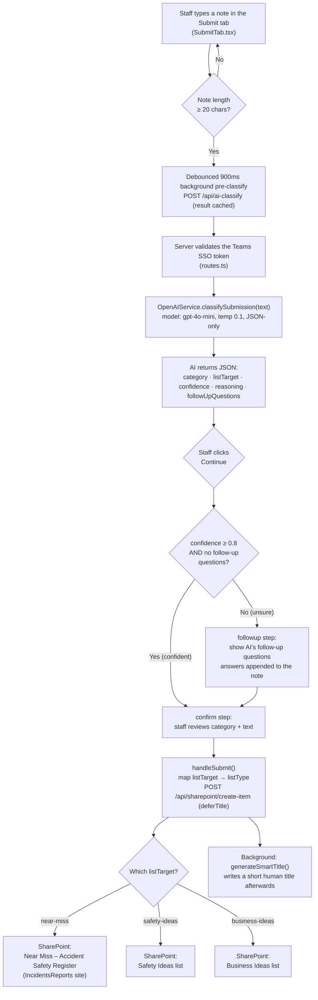

# Cranfield Glass — Improve+ Teams App

> *Small ideas. Continuous improvement.*

This folder contains the Teams Personal Tab app package for the Cranfield Glass staff engagement system. The app's display name in Teams is **Improve+**.

## What the app contains

The personal tab has two screens, switched via a small **segmented toggle at the top of the content** (Submit / Orders). It is deliberately *not* a bottom navigation bar — Teams already provides its own navigation along the bottom of the window, so an in-content toggle keeps the two clearly separate and makes the screen feel like part of the app rather than a second nav layer.

| Tab | Route | Purpose |
|-----|-------|---------|
| **Submit** | `/teams-submit-cg7k2x9m` (manifest) / `/teams-tab` (toggle) | Describe a near miss, safety observation, supply request, or improvement idea. AI classifies it and routes it to the correct SharePoint list. Shows a prominent "Hi {first name} 👋" greeting with the tagline *Small ideas. Continuous improvement.* |
| **Orders** | `/teams-tab/orders` (toggle) | Shared ordering whiteboard — every signed-in staff member sees the same list; staff add items they need ordered, and admins can remove items (swipe a card sideways) or clear the whole list. |

The Teams manifest registers a single static tab pointing to the Submit screen. The Orders screen is reached via the in-app toggle inside the same iframe — no second manifest entry is needed.

## Folder contents (this `teams-app/` package)

- `manifest.json` — Teams app manifest (schema v1.16)
- `bump-version.js` — helper to increment the manifest version before re-packaging
- `color.png` — 192×192 full-colour icon (required by Teams)
- `outline.png` — 32×32 transparent outline icon (required by Teams)
- `README.md` — this file

## All system files (the complete Teams personal-tab)

The packaging folder above is only the manifest + icons. The running app is built
from source files spread across the repo. Everything the personal tab needs is
listed below — if you copy the Teams tab into another project, take these files (plus
the `teams-app/` package above).

### Frontend — Teams tab UI (`client/`)

| File | Role |
|------|------|
| `client/src/App.tsx` | Teams routing + chrome. Defines the Teams routes (`TEAMS_PATHS`: `/teams-submit-cg7k2x9m`, `/teams-tab`, `/teams-tab/orders`), the `TeamsRouter`/`TeamsRouterContent` wrapper, the top **Submit / Orders** segmented toggle (`TeamsTabSwitcher` using Fluent `TabList`), the "Hi {name} 👋" greeting, and the shared blue theming (both tabs use the default Teams blue brand). |
| `client/src/pages/teams/SubmitTab.tsx` | **Submit** screen. AI-classify state machine (`input → classifying → followup → confirm → submitting → done`); debounced background pre-classify; the keyboard-safe textarea; the "Continue / Reading your note…" button; posts the final item to SharePoint. See *How the AI categorisation works* below. |
| `client/src/pages/teams/OrdersTab.tsx` | **Orders** screen. Shared team order list (anyone adds; admins remove or clear); admin detection; admins delete an item by **swiping the card sideways** (framer-motion). |
| `client/src/pages/teams/TeamsPageShell.tsx` | Reusable layout shell shared by both tabs: `TeamsPage`, `TeamsPinned` (keyboard-safe, never scrolls), `TeamsScroll` (the single scroll region), `TeamsCenter`, `TeamsFullScreen` (sign-in / error template), and the `useKeyboardSafeFocus` hook. |
| `client/src/hooks/useTeamsTheme.tsx` | Reads the Teams theme mode (`default` / `dark` / `contrast`) from `@microsoft/teams-js` and provides it via `TeamsThemeProvider` + `useTeamsTheme()`, so the tab follows the user's Teams light/dark/high-contrast setting. |

### Backend — shared API (`server/`)

These endpoints are shared with the main website; they detect the incoming token's
audience and apply OBO only for Teams SSO tokens (see *Authentication* below).

| File | Role |
|------|------|
| `server/teams-obo-auth.ts` | The OBO exchange. `getDownstreamToken(req, 'graph' \| 'sharepoint')` swaps the Teams SSO token for the downstream Graph/SharePoint token, with server-side caching. The portable, copy-me-into-a-fork auth module. |
| `server/routes.ts` | The API endpoints the tabs call: **Submit** → `POST /api/ai-classify`, `POST /api/sharepoint/create-item`; **Orders** → `GET /api/orders`, `POST /api/orders`, `GET /api/orders/is-admin`, `PATCH /api/orders/:id`, `DELETE /api/orders/:id`, `POST /api/orders/clear`. Also holds the `ORDER_ADMINS` allowlist. |
| `server/storage.ts` | Persistence for the Orders list (`orderItems` CRUD) via the storage interface. |

### Shared types (`shared/`)

| File | Role |
|------|------|
| `shared/schema.ts` | The `orderItems` table (`order_items`), `insertOrderItemSchema`, and the `OrderItem` / `InsertOrderItem` types used by both the Orders tab and the server. |

## How the AI categorisation works

This is the heart of the **Submit** tab: a staff member types a plain-English note
("the third rung on the warehouse ladder is cracked"), and the AI decides whether
that is a **Near Miss**, a **Safety** item, or a **Business** item, then routes it to
the correct SharePoint list — without the staff member having to know those
categories exist.

### The big picture



### Step by step

1. **Typing (frontend — `SubmitTab.tsx`).** As the staff member types, once the note
   reaches **20 characters** a **debounced** call (fires ~900ms after they stop
   typing) runs in the background to `POST /api/ai-classify`. The *"Reading your
   note…"* state only shows once that request is actually in flight, not while they
   are still typing. This "pre-classify" means the answer is usually already
   waiting by the time they press **Continue**, so the UI feels instant. The result
   is cached per-note-text so identical text isn't re-sent.

2. **Token check (backend — `server/routes.ts`).** `/api/ai-classify` first validates
   the incoming **Teams SSO token** (the same OBO-aware auth used everywhere — see
   *Authentication* below). No valid user, no classification.

3. **The actual decision (backend — `server/openai-service.ts`).**
   `OpenAIService.classifySubmission(text)` sends the note to **OpenAI `gpt-4o-mini`**
   with a **system prompt** that defines Cranfield Glass's categories and rules. It
   runs at **temperature 0.1** (near-deterministic, so the same note classifies the
   same way) and is forced to reply as **JSON only**. The model returns:

   | Field | Meaning |
   |-------|---------|
   | `category` | One of: *Near Miss*, *Safety Observation*, *Improvement Idea*, *Business Improvement*, *Supply Request*, *Meeting Agenda Item*, *Other* |
   | `listTarget` | The destination bucket: `near-miss`, `safety-ideas`, or `business-ideas` |
   | `confidence` | `0.0`–`1.0` — how sure the AI is |
   | `reasoning` | A short plain-English explanation (shown for transparency) |
   | `followUpQuestions` | Extra questions to ask **only when the AI is unsure** |

4. **How the seven categories collapse into three lists.** Several categories share a
   list — staff never see the SharePoint plumbing:

   | AI `category` | `listTarget` | SharePoint list |
   |---------------|--------------|-----------------|
   | Near Miss | `near-miss` | Near Miss – Accident Safety Register |
   | Safety Observation | `safety-ideas` | Safety Ideas |
   | Improvement Idea | `safety-ideas` | Safety Ideas |
   | Business Improvement | `business-ideas` | Business Ideas |
   | Supply Request | `business-ideas` | Business Ideas |
   | Meeting Agenda Item | `business-ideas` | Business Ideas |
   | Other | `business-ideas` | Business Ideas |

5. **Confidence gate (the `followup` step).** If `confidence` is **below 0.8** (or the
   AI supplied follow-up questions), the UI does **not** guess — it shows those
   follow-up questions (e.g. *"Where did this happen?"*, *"What task were you
   doing?"*). The answers are appended to the original note so the final record is
   richer. If the AI is confident, this step is skipped and the user goes straight to
   the **confirm** screen showing the chosen category and a *"NN% sure"* badge.

6. **Submission (frontend → backend).** On confirm, `handleSubmit()` maps the
   `listTarget` to a `listType` (`LIST_TYPE_MAP`: `near-miss → "Near Miss"`,
   `safety-ideas → "Safety Ideas"`, `business-ideas → "Business Ideas"`) and posts to
   `POST /api/sharepoint/create-item` with `deferTitle: true`.

7. **Fast title generation.** The create-item endpoint returns immediately, then a
   **background** `generateSmartTitle()` call (also `gpt-4o-mini`) writes a short,
   tradesperson-style title (e.g. *"Cracked rung on warehouse ladder"*) onto the
   SharePoint item a moment later — so the staff member's success screen isn't blocked
   waiting on a second AI call.

### Where to change things (future enhancements)

- **Add or reword a category, or change the routing rules** → edit the `systemPrompt`
  in `server/openai-service.ts` (`classifySubmission`). The category list, the
  list-target mapping, and the per-category follow-up questions all live in that one
  prompt string.
- **Add a brand-new SharePoint list as a destination** → add it to `LIST_CONFIGS` in
  `server/sharepoint-lists-service.ts` (field mappings + site URL), add the new
  `listTarget` value to the prompt, and extend `LIST_TYPE_MAP` in `SubmitTab.tsx`.
- **Make the AI more/less cautious about asking follow-up questions** → change the
  **0.8** confidence threshold in `SubmitTab.tsx`.
- **Swap the model or tune determinism** → the `model` and `temperature` are set in
  `server/openai-service.ts`. `gpt-4o-mini` is chosen for speed; `gpt-4o` would be
  more accurate but slower and dearer.
- **Change the title style** → edit the `generateSmartTitle` prompt in
  `server/openai-service.ts`.
- **API key** → the OpenAI key is read from the `OPENAI_API_KEY` environment
  variable. If the key is missing or OpenAI errors, `classifySubmission` does **not**
  block the user — it returns a safe **fallback** (`category: "Other"`,
  `listTarget: "business-ideas"`, `confidence: 0.5`, plus generic follow-up
  questions), so the note still goes through, just into Business Ideas. (Submission
  is only blocked earlier, in `SubmitTab.handleContinue`, if the *network/auth*
  request itself fails — token invalid, offline, etc.) Title generation in step 7
  likewise falls back gracefully since the item is already saved by then.

## How to package and upload

1. Zip only the manifest and the two icons (not the folder, and not this README or the helper script):
   ```
   cd teams-app
   zip ../improve-plus.zip manifest.json color.png outline.png
   ```

2. Go to **Teams Admin Center → Teams apps → Manage apps → Upload new app**.

3. Upload `improve-plus.zip`.

4. Once approved, users find it under **Apps → Built for your org** and pin it as a personal tab.

## Before packaging for a new domain

If the app is ever moved to a custom domain or a new Replit deployment, update these four fields in `manifest.json`:

- `staticTabs[0].contentUrl`
- `staticTabs[0].websiteUrl`
- `validDomains[0]`
- `webApplicationInfo.resource`

## Authentication — On-Behalf-Of (OBO)

This app uses the **OAuth 2.0 On-Behalf-Of flow**. The browser never holds a Microsoft Graph or SharePoint token — it only ever holds a Teams SSO token, and the **server** swaps that for the downstream tokens it needs.

### How it works

Both tabs sign in the **same silent way**. There is no popup, no redirect, and no interactive fallback — this is an internal-staff app that only runs inside Teams.

1. **Teams hands the tab a single SSO token** via `microsoftTeams.authentication.getAuthToken()`. The audience of that token is *this* Azure AD app (not Graph or SharePoint), so the browser cannot call those APIs with it directly.
2. **The tab sends that token to our backend** as a normal `Authorization: Bearer <token>` header on API requests that need Microsoft 365 access.
3. **The backend exchanges it On-Behalf-Of the signed-in user** (`server/teams-obo-auth.ts`, using `@azure/msal-node`'s `acquireTokenOnBehalfOf`) for the downstream access token each endpoint actually needs — Microsoft Graph or SharePoint.
4. **Downstream tokens are cached server-side** (in memory, keyed by a hash of the assertion + resource) until shortly before they expire, so repeat requests don't re-exchange. The raw token is never logged.

Because routing is decided by the incoming token's audience, the **main (non-Teams) website is unaffected**: it still uses browser MSAL and sends ready-made Graph/SharePoint tokens, which the backend detects and passes through unchanged. The same API endpoints serve both clients.

> Outside Teams (e.g. opening the route in a plain browser) `getAuthToken()` throws *"No Parent window found"* and the tab shows a **Sign in required** screen. That is expected — there is no Teams parent to issue the SSO token.

### Server environment variables (required)

The OBO exchange runs with the app's **confidential client** credentials. Set these as server secrets — never expose them to the browser:

| Variable | What it is |
|----------|-----------|
| `AZURE_CLIENT_ID` | The Azure AD app (client) ID |
| `AZURE_CLIENT_SECRET` | A client secret generated under *Certificates & secrets* |
| `AZURE_TENANT_ID` | The Azure AD tenant (directory) ID |

### Downstream delegated permissions (must be consented)

The OBO exchange requests these delegated scopes. Admin consent must already be granted for the tenant (the existing browser MSAL flow uses the same scopes, so consent is normally already in place):

- **Microsoft Graph:** `User.Read`, `Sites.Read.All`
- **SharePoint** (`https://cranfieldglass.sharepoint.com`): `AllSites.FullControl`

If a scope has not been consented the backend returns a clear `403` asking an administrator to grant the app's delegated permissions. An expired/stale SSO token returns `401` (sign in again).

### Azure AD app registration — one-time setup (for this app or a fork)

The Teams tab shares the existing Azure AD app. No second registration is needed because the main site and the Teams tab are served from the same domain.

For Teams SSO + OBO to work, the app registration needs:

**1. Application ID URI** (*Expose an API*):
```
api://staff-engagement-system.replit.app/dad12e09-3e7f-42fa-86e8-a0378bdd2699
```
For a fork, use `api://<your-domain>/<your-client-id>` and update `webApplicationInfo.resource` in `manifest.json` to match.

**2. The `access_as_user` scope** (*Expose an API → Add a scope*):
- Name: `access_as_user`
- Who can consent: Admins and users
- State: Enabled

**3. Authorize the Teams client applications** (*Expose an API → Authorized client applications*) — add both so Teams can issue the SSO token without prompting:
- `1fec8e78-bce4-4aaf-ab1b-5451cc387264` (Teams desktop & mobile)
- `5e3ce6c0-2b1f-4285-8d4b-75ee78787346` (Teams web)

**4. A client secret** (*Certificates & secrets*) → store it on the server as `AZURE_CLIENT_SECRET`.

**5. API permissions** — add and admin-consent the delegated scopes listed above (Graph `User.Read`, `Sites.Read.All`; SharePoint `AllSites.FullControl`).

### Reusing this auth setup in a new (forked) project

1. Copy `server/teams-obo-auth.ts` and call `getDownstreamToken(req, 'graph' | 'sharepoint')` inside your route handlers.
2. Register (or reuse) an Azure AD app and complete steps 1–5 above.
3. Set `AZURE_CLIENT_ID`, `AZURE_CLIENT_SECRET`, and `AZURE_TENANT_ID` as server secrets.
4. In `teams-obo-auth.ts`, update `TEAMS_APP_AUDIENCE_MARKERS` (client id + `api://` URI), `SHAREPOINT_RESOURCE`, and the scope lists to match your tenant and domain.
5. Point `manifest.json`'s `webApplicationInfo`, `validDomains`, and `staticTabs` URLs at your domain.

## Icons

The icons are a modern **plus** mark, matching the **Improve+** name.
- `color.png` — 192×192 px, white plus on the brand blue (`#2563EB`), PNG
- `outline.png` — 32×32 px, **transparent background with a white plus only**, PNG

> The outline icon is the one Teams shows in the left nav rail. It **must stay transparent + a single colour (white)** so Teams can tint it with its own theme colour. A flat or fully-coloured outline makes Teams display that literal colour instead of applying its override.
